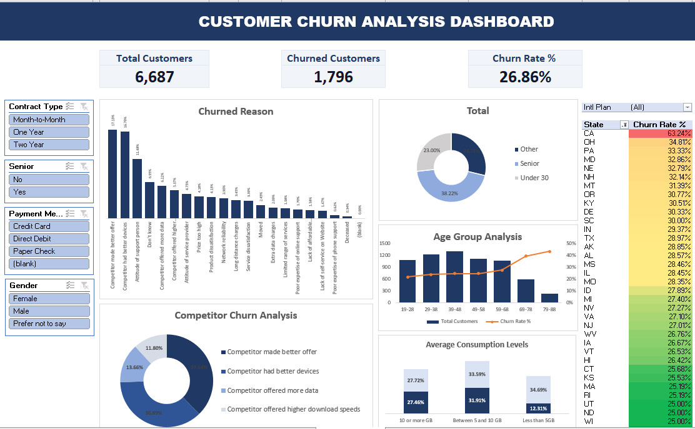
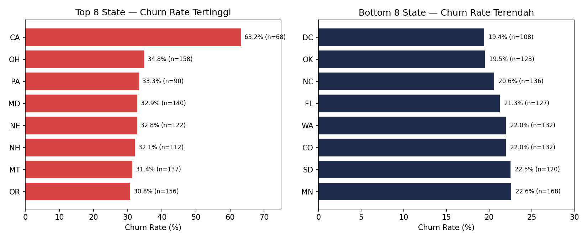

<h1 align="center">📉 Telecom Customer Churn Analysis</h1>

<em>Identifying who churns, why they leave, and the revenue at risk</em>

<table align="center">
  <tr>
    <td width="1440">
      <h2 align="center">Project Background &amp; Overview</h2>
      <body>
        This dataset originates from a <strong>telecommunications</strong> company serving customers across the United States, covering local &amp; international telephone services, data plans, and device protection programs. The company faces a significant level of <strong>customer churn</strong> and aims to understand the underlying patterns before designing retention strategies.  
         
        This analysis covers <strong>6,687 customers</strong> with <strong>30 attributes</strong> per customer - ranging from demographic data, contract types, payment methods, and usage patterns to specific reasons why churned customers decided to cancel. This report is compiled for the <strong>Customer Retention &amp; Operations</strong> team to identify high-risk segments and prioritize mitigation steps.  
         Key insights and recommendations focus on four core Northstar Metrics:
      </body>
      <h3>Northstar Metrics</h3>
      <h4>
        <ul>
          <li><strong>Churn Rate:</strong> The proportion of customers who stop subscribing, overall and across segments.</li>
          <li><strong>Revenue at Risk:</strong> Monthly or historical revenue lost due to churn.</li>
          <li><strong>Churn Drivers:</strong> Contract factors, payment methods, tenure, and usage most strongly correlated with churn.</li>
          <li><strong>Churn Reasons:</strong> Qualitative reasons provided by customers upon cancellation, grouped by category.</li>
        </ul>
      </h4>
    </td>
  </tr>
</table>

<table align="center">
  <tr>
    

      <h1 align="center">Technical Implementation &amp; Architecture</h1>
      <h3 align="center">From Data Processing to Exploratory Analysis</h3>
      <td width="920" valign="top">
        <ol>
          <li>
            <strong>Tech Stack &amp; Tools:</strong>
            <ul>
              <li>Microsoft Excel (Data cleaning, PivotTables, slicers, and interactive dashboard).</li>
              <li>Python (pandas, matplotlib) (In-depth quantitative analysis &amp; supporting visualization).</li>
            </ul>
          </li>
          <li>
            <strong>Dataset Structure:</strong>
            <ul>
              <li>Granular fact table per customer (`Customer`, 6,687 rows × 30 columns), summarized into derivative sheets for pivot tables &amp; dashboards.</li>
              <li>Key columns include: `Contract Type`, `Payment Method`, `Account Length (in months)`, `Monthly Charge`, `Total Charges`, `Customer Service Calls`, `Avg Monthly GB Download`, `Unlimited Data Plan`, `Senior`, `Age`, `State`, `Churned`, `Churn Category`, and `Churn Reason`.</li>
            </ul>
          </li>
        </ol>
      </td>
    

  </tr>
</table>

<table align="center">
  <tr>
    <h1 align="center">Dashboard Preview</h1>
    

      <h3>Interactive Executive Dashboard</h3>
      
    

    <td width="900" valign="top">
      
<em>The interactive dashboard is built in Excel featuring slicers for Contract Type, Senior, Payment Method, and Gender.</em>

      <ul>
        <li><strong>Live Interactivity:</strong> Visuals map high-risk factors clearly for operational and executive consumption.</li>
        <li><strong>Access &amp; Files:</strong> The report file and primary data source (`Churn_Analysis_Dashboard.xlsx`) can be downloaded directly from this repository.</li>
      </ul>
    </td>
  </tr>
</table>

<h1 align="center">Executive Summary &amp; Insights Deep-Dive</h1>
<table align="center">
  <tr>
    <h1 align="center">Executive Summary</h1>
    <td width="1000" valign="top">
      <ol>
        <li><strong>Overall Churn Rate of 26.9%:</strong> A total of 1,796 out of 6,687 customers stopped subscribing (more than 1 in 4 customers).</li>
        <li><strong>Month-to-Month Contracts as Main Driver:</strong> Churn rate reaches 46.3%, far exceeding Two Year (2.8%) and One Year (11.3%) contracts.</li>
        <li><strong>Low Tenure = High Risk:</strong> Customers in their first 12 months account for 47.7% of total churn, dropping sharply to 3.7% for those with 73–84 months of tenure.</li>
        <li><strong>Competitors as Reason #1:</strong> 45.5% of churn reasons are driven by competitors (better offers or devices), rather than pricing issues alone.</li>
        <li><strong>California Geographic Outlier:</strong> California recorded the most extreme churn rate at 63.2% (43 out of 68 customers) — nearly double the second-highest state (Ohio, 34.8%).</li>
        <li><strong>Significant Revenue at Risk:</strong> Around $66K/month (~$793K/year) is lost from churned customers, with the majority originating from the Month-to-Month segment ($57K).</li>
      </ol>
    </td>
  </tr>
</table>

<table align="center">
  <tr>
    <td width="333" valign="top">
      <h3>Contracts &amp; Payments</h3>
      <ul>
        <li>Paper Check (38.0%) and Direct Debit (34.5%) payment methods exhibit much higher churn compared to Credit Card (14.5%).</li>
        <li>The combination of Month-to-Month contracts with manual payment methods records churn rates exceeding 50%.</li>
      </ul>
    </td>
    <td width="333" valign="top">
      <h3>Usage &amp; Services</h3>
      <ul>
        <li>Customers with unlimited data plans but usage &lt;5GB show a 34.7% churn rate - an indicator of overpaying for unused capacity.</li>
        <li>Churned customers average 2.40 customer service calls (~6.5x higher than retained customers), making it a strong early warning signal.</li>
      </ul>
    </td>
    <td width="333" valign="top">
      <h3>Geographic Distribution</h3>
      <ul>
        <li>California is the highest outlier (63.2%), followed by high-churn clusters like Ohio (34.8%) and Pennsylvania (33.3%).</li>
        <li>Extreme gaps across regions indicate localized competition factors or varying network quality.</li>
      </ul>
    </td>
  </tr>
</table>

<table align="center">
  <tr>
    <td width="1000">
      <h3 align="center">Geographic Churn Distribution (Highest &amp; Lowest States)</h3>
      

        
      

      
<em>California stands out as a severe geographic outlier with a 63.2% churn rate, whereas states like District of Columbia (19.4%), Oklahoma (19.5%), North Carolina (20.6%), and Florida (21.3%) record the lowest churn rates.</em>

    </td>
  </tr>
</table>

<table align="center">
    <h1>Recommendations</h1>
    <h4>Based on the analytical findings, here are strategic mitigation steps to reduce churn rates:</h4>
      <ul>
        <h3>Contracts &amp; Payments</h3>
        <li>Prioritize migration campaigns from <strong>Month-to-Month to One/Two Year contracts</strong> (e.g., 1–2 months discount or free devices).</li>
        <li>Drive adoption of <strong>Credit Card/auto-pay billing</strong> to minimize churn risk among customers using manual payment methods.</li>
        <h3>Early Retentions &amp; Customer Support</h3>
        <li>Build an <strong>active onboarding &amp; check-in program during the first 12 months</strong> (the critical period with a 47.7% churn rate).</li>
        <li>Utilize <strong>customer service call volume</strong> as an early warning trigger for proactive retention team intervention.</li>
        <h3>Competitor Strategy &amp; Support Quality</h3>
        <li>Perform regular <strong>competitive benchmarking</strong> on pricing and devices, and improve the quality of *customer support* interactions to resolve "attitude of support person" issues.</li>
        <h3>Package Optimization &amp; Special Segments</h3>
        <li>Offer <em>right-sizing</em> data plans for low-usage unlimited users so billing matches actual needs.</li>
        <li>Design tailored, personalized retention programs for <strong>senior customers (65+)</strong>.</li>
        <h3>Geographic Focus</h3>
        <li>Conduct an in-depth investigation for <strong>California</strong> (63.2% churn) to identify specific root causes, and audit network quality across other high-churn states (OH, PA, MD, NE). Also, benchmark retention practices from low-churn states like <strong>District of Columbia (19.4%)</strong> and <strong>Oklahoma (19.5%)</strong>.</li>
      </ul>
</table>

<table align="center">
  <h1>Repository Structure &amp; Reproducibility</h1>
  <tr>
    <td width="900">
      <ul>
        <li><code>Churn_Analysis_Dashboard.xlsx</code> - Primary data source &amp; interactive Excel dashboard.</li>
        <li><code>photos</code> - dashboard screenshots &amp; supporting analysis charts.</li>
        <li><code>README.md</code> - Comprehensive project documentation report.</li>
      </ul>
    </td>
  </tr>
</table>
